# Conociendo el sistema.

## Nombre del Host

## Cambiar el host sin reiniciar

## Versión del sistema

## Memoria RAM

## CPU

## Versión del núcleo y arquitectura
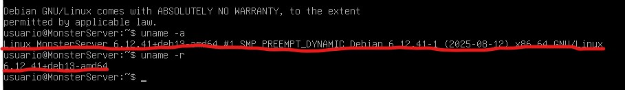

## Discos y particiones
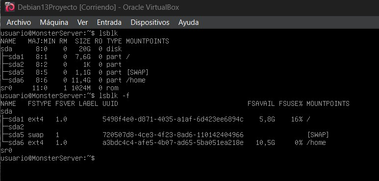

## Sistemas montados

## Tamaño de una carpeta
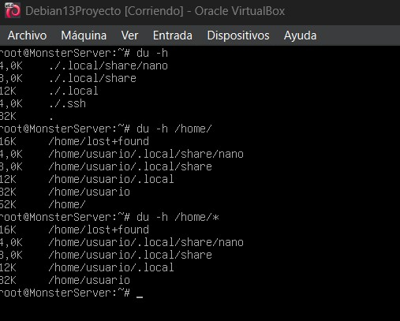

## Usuarios y grupos del sistema
1. Usuarios

cat /etc/passwd 

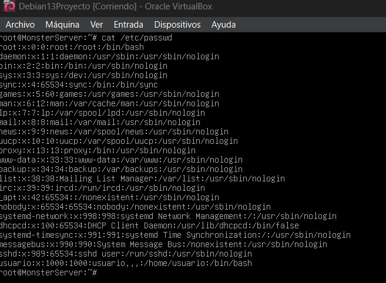

cat /etc/shadow

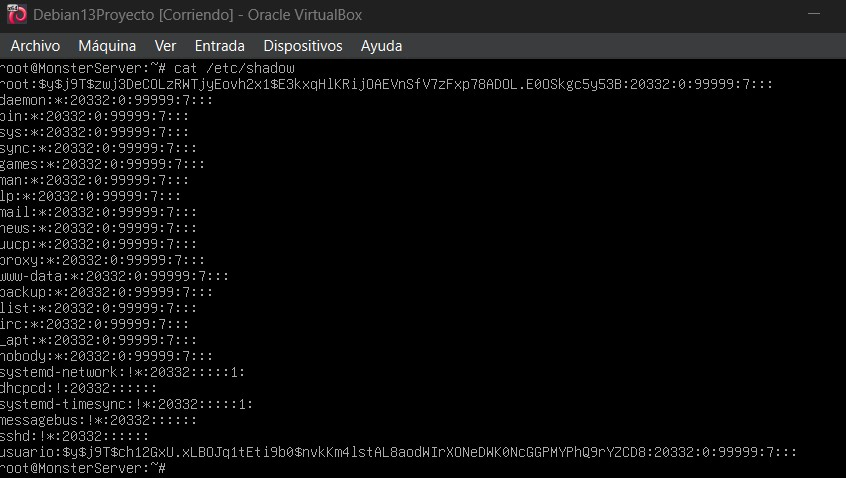

2. Grupos

cat /etc/group 

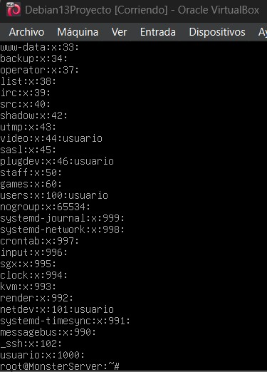

cat /etc/gshadow

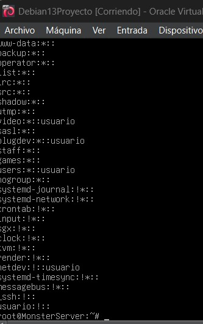

## Información de la red

## Comprobar DNS
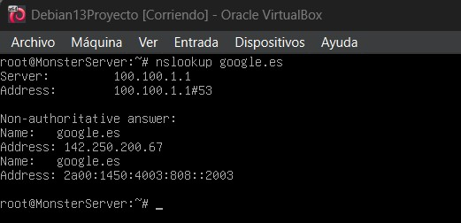

## Configuración de la red: /etc/network/interfaces
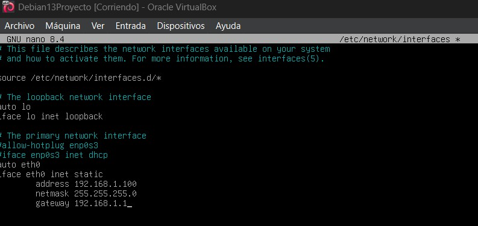

## Configuración tradicional DNS: cat /etc/resolv.conf
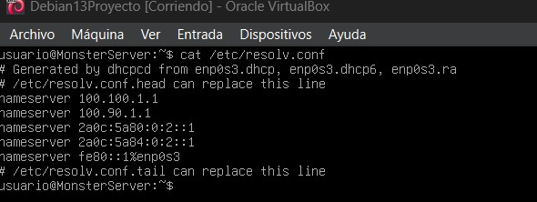

## Reiniciar la red (Debian sin ENTORNO GRÁFICO utiliza networking)
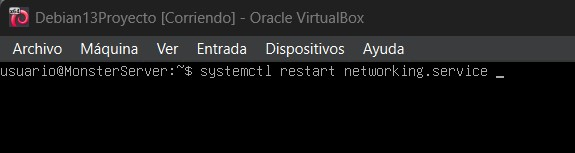

## Si necesitamos bajar o subir una tarjeta de red:

## Configuración de la red: Otra forma: /etc/resolv.conf

