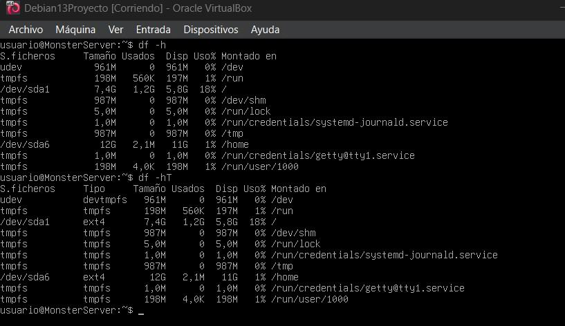
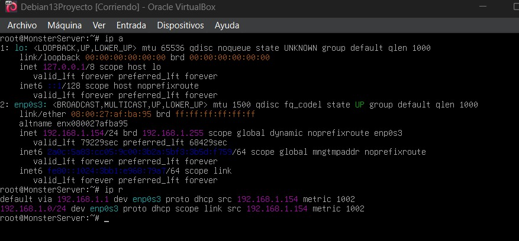

# Conociendo el sistema.

## Nombre del Host

## Cambiar el host sin reiniciar

## Versión del sistema

## Memoria RAM

## CPU

## Versión del núcleo y arquitectura

## Discos y particiones

## Sistemas montados

## Tamaño de una carpeta

## Usuarios y grupos del sistema
1. Usuarios

cat /etc/passwd 

cat /etc/shadow

2. Grupos

cat /etc/group 

cat /etc/gshadow

## Información de la red

## Comprobar DNS

## Configuración de la red: /etc/network/interfaces

## Configuración tradicional DNS: cat /etc/resolv.conf

## Reiniciar la red (Debian sin ENTORNO GRÁFICO utiliza networking)

## Si necesitamos bajar o subir una tarjeta de red:

## Configuración de la red: Otra forma: /etc/resolv.conf

